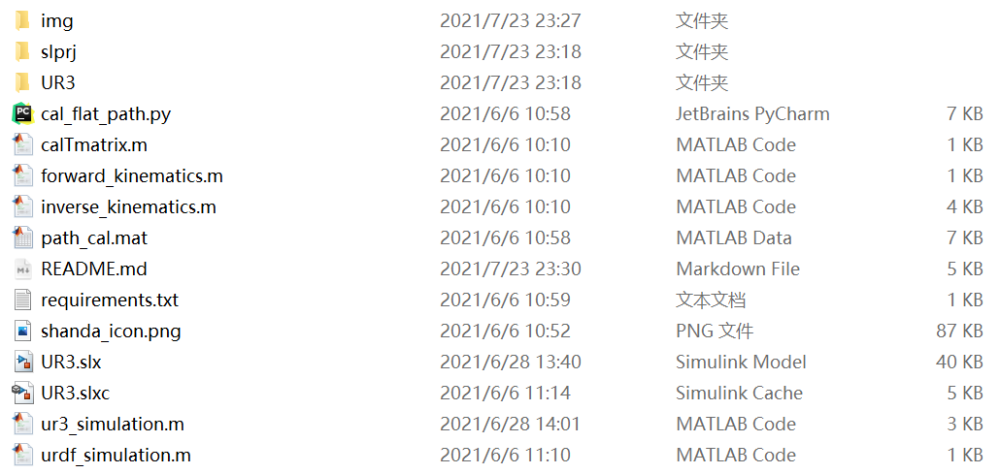
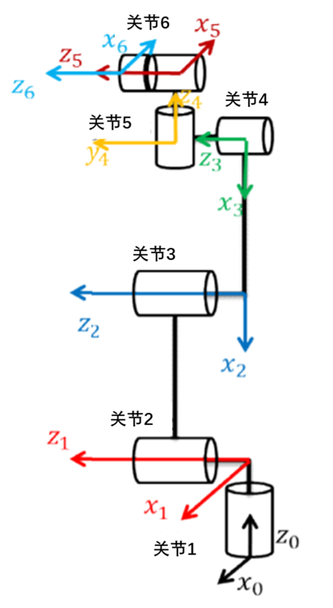
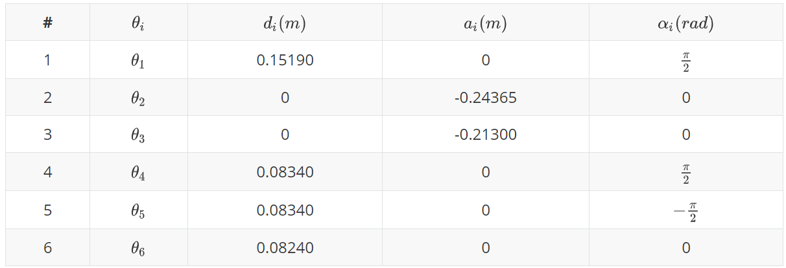
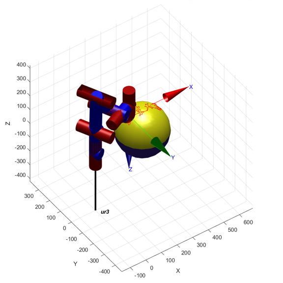
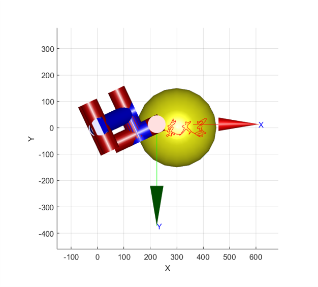
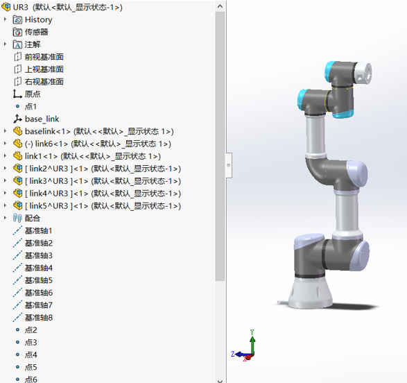
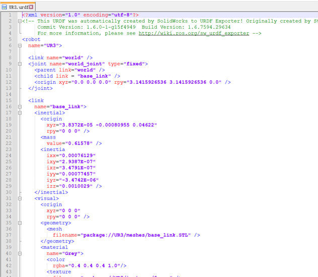
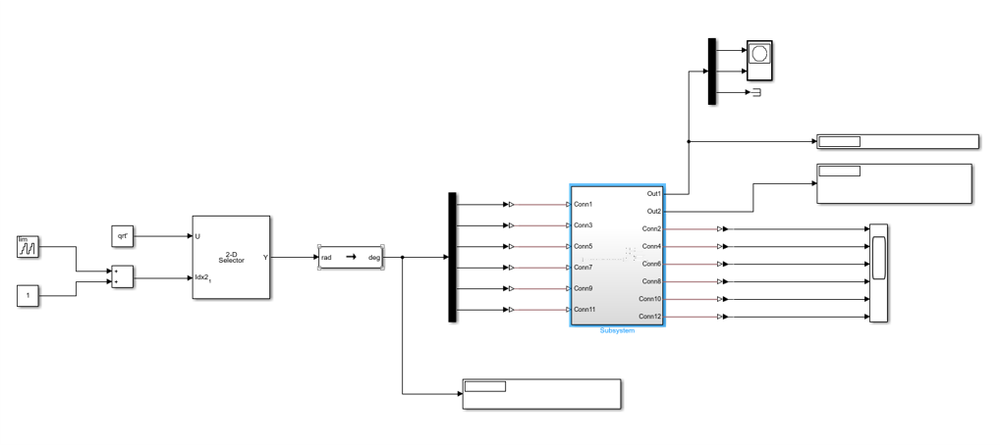
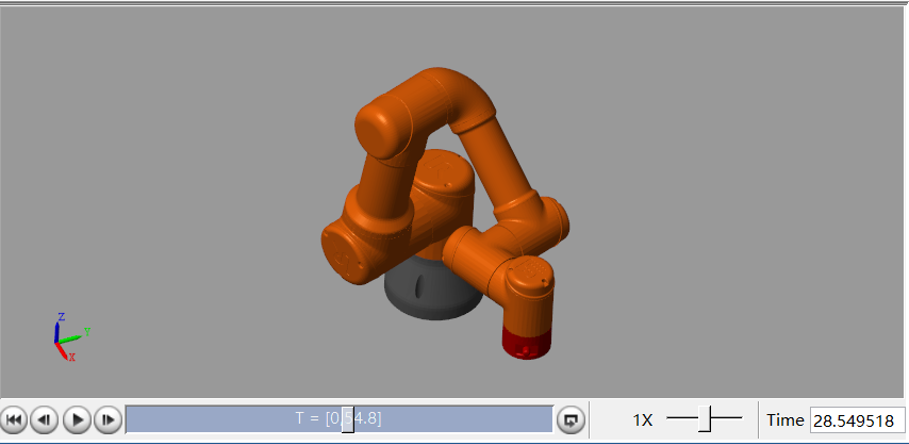

# Matlab UR3机械臂仿真

> 山东大学（威海）数学与统计学院
>
> 2018级 数据科学与人工智能 孙易泽

### 文件介绍

<table>
    <tr>
        <td ><center> </center></td>
    </tr>
    <tr>
        <td><center>文件内容</center> </td>
    </tr>
</table>
在“项目代码”文件夹中包含了全部运行程序，其中包括：

+ 文件夹
  + img：项目说明图片
  + slprj：Simscape自动生成文件夹
  + UR3：UR3机器人的urdf导出文件
+ 文件
  + cal_flat_path.py：轨迹点计算python程序
  + calTmatrix.m：matlab运行函数
  + forward_kinematics.m：正运动学matlab程序
  + inverse_kinematics.m：逆运动学matlab程序
  + path_cal.mat：“山大”轨迹点路径变量
  + requirements.txt：python运行环境
  + shanda_icon.png：“山大“文字图片
  + **UR3.slx：Simscape可视化**
  + UR3.slxc：Simscape自动保存文件
  + **ur3_simulation.m：Robotics Toolbox工具箱仿真**
  + urdf_simulation.m：urdf导入Simscape程序
  
  

### 坐标系建立

<table>
    <tr>
        <td ><center> </center></td>
        <td ><center></center></td>
    </tr>
    <tr>
        <td><center>UR3机械臂数据</center></td>
        <td><center>UR3坐标系建立</center> </td>
    </tr>
</table>


### D-H参数表




### 轨迹点计算

在计算写字轨迹时，通过对图片进行边缘提取，以及最短路径规划，完成在二维平面上轨迹点的选取。

+ 首先选取需要文字图片，这里选用山东大学的校徽文字
+ 选取完成后提取图片轮廓，并找出全部的连通分量
+ 从提取的轮廓中抽取样本点，并使用Douglas–Peucker算法，将全部样本点用一条线相连
+ 完成样本点顺序的计算后，将计算结果保存到path_cal.mat文件中。

本部分在编程时，使用python计算轨迹点。

<table>
    <tr>
        <td ><center> </center></td>
        <td ><center> </center></td>
    </tr>
    <tr>
        <td><center>初始图片</center> </td>
        <td><center>提取连通分量</center> </td>
    </tr>
    <tr>
        <td ><center> </center></td>
        <td ><center> </center></td>
    </tr>
    <tr>
        <td><center>提取样本点</center> </td>
        <td><center>构建连通图</center> </td>
    </tr>
</table>


### Matlab Robotics Toolbox工具箱仿真

**ur3的仿真在 ur3_simulation.m 文件中，**首先导入二维平面计算的轨迹点，然后利用球面方程：
$$
(x-x_0)^2+(y-y_0)^2+(z-z_0)^2=r^2
$$
在本程序中，球心的坐标 $(x_0,y_0,z_0)=(300, 0,0)$，球面半径$r=150$。

分别带入x坐标和y坐标，计算出z轴坐标，得到三维空间中机械臂轨迹。

最后利用ikunc函数进行求解，计算出关节角变化。

<table>
    <tr>
        <td ><center> </center></td>
        <td ><center> </center></td>
    </tr>
    <tr>
        <td><center>仿真侧视图</center> </td>
        <td><center>仿真俯视图</center> </td>
    </tr>
</table>


### Matlab Simscape可视化

为了整体美观，这里使用Simulink的Simscape模块进行可视化。

首先将原有STEP进行组装，并导出urdf文件：

<table>
    <tr>
        <td ><center> </center></td>
        <td ><center> </center></td>
    </tr>
    <tr>
        <td><center>solidwork组装</center> </td>
        <td><center>导出urdf文件</center> </td>
    </tr>
</table>

导出后，使用matlab加载urdf文件（urdf_simulation.m），并导入Simscape：

```matlab
% 加载事先用solidwork导出的urdf模型
robot = importrobot('UR3/urdf/UR3.urdf');
showdetails(robot);
show(robot,'Frames','on','Visuals','on');
robot_sm = smimport('UR3/urdf/UR3.urdf');
```

导入Simscape后，创建子系统，**将Robotics Toolbox工具箱计算的六轴关节角作为输入**，分别构建六轴的输入输出：

<table>
    <tr>
        <td ><center> </center></td>
    </tr>
    <tr>
        <td><center>Simscape仿真</center> </td>
    </tr>
</table>


最后运行Simscape，查看可视化动画效果：

<table>
    <tr>
        <td ><center> </center></td>
    </tr>
    <tr>
        <td><center>可视化视频效果</center> </td>
    </tr>
</table>
